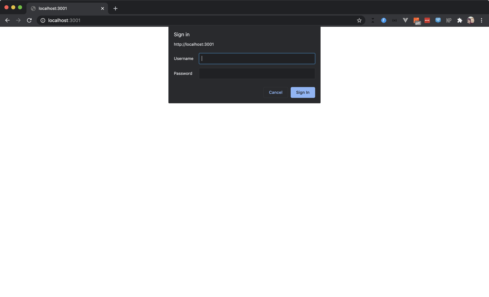

# Basic App

## Node.js Setup

Install Node.js. Using [nvm](https://github.com/nvm-sh/nvm) is a good approach
since it simplifies switching Node.js versions.

``` bash
# install nvm
curl -o- https://raw.githubusercontent.com/nvm-sh/nvm/v0.35.3/install.sh | bash

# update your ~/.bashrc or ~/.bash_profile based on the nvm output
vi ~/.bash_profile

# install and enable node.js 12
nvm install 12
nvm use 12
```

## Run the Application

### In Development Mode

This starts the server in dev mode using `nodemon`. This enables live reload
for changes so you don't need to restart the server each time you make a
change.

```bash
npm install
npm run dev
```

### Production Mode

```bash
npm start
```

## Authentication

This application uses Basic Authentication. It will prompt for a username and
password to login.

Use a username and password from the `users.js` file in this repository, e.g
`jane` and `janepass`.


